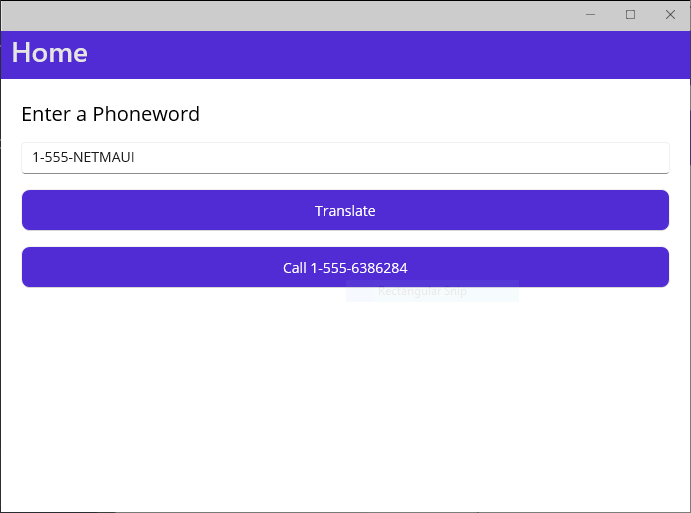
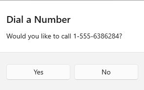
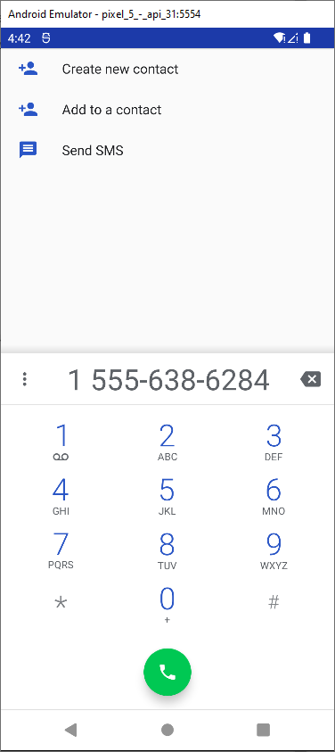

<<<<<<< HEAD
# LearnLiveMAUI
Learn how to use .NET MAUI to build apps that run on mobile devices and on the desktop using C# and Visual Studio. You'll learn the fundamentals of building an app with .NET MAUI and more advanced topic such as local data storage and invoking REST-based web services.

The learning experience can be access from <a href="https://learn.microsoft.com/en-us/events/learn-events/learnlive-mobile-desktop-apps-dotnet-maui/?source=docs" target="_blank">here</a>
=======
# Phone translator
This project belongs to module 01 of Buil apps with .NET MAUI.
This project consists in translate text to numeric digits

We create a form to ask the alphanumeric number

When press call, we should see a pop up to confirm the operation

When press yes to the pop up abowe, the phone dialer shoul be appears with the number you provided in the input screen

>>>>>>> origin/master
