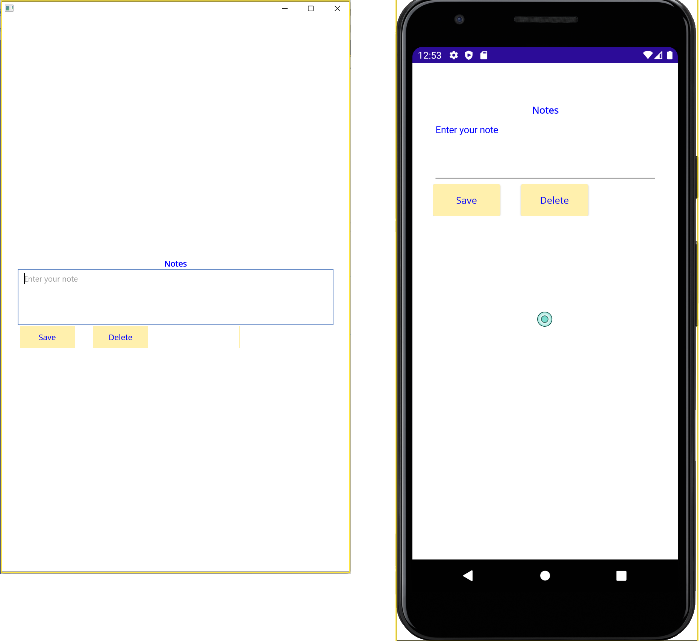
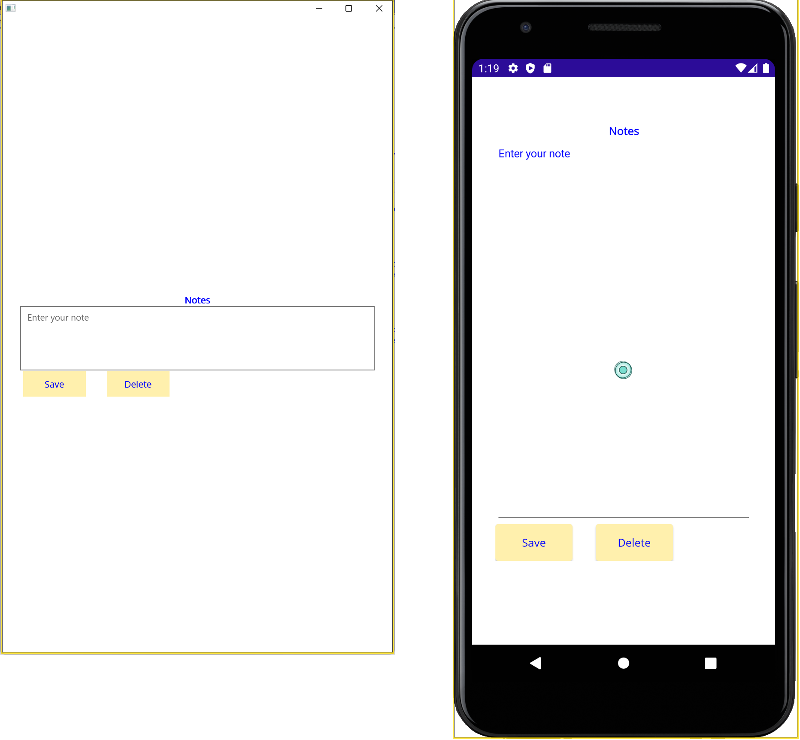

# Create a UI using XAML
This solkution belogs to the second part of **.NET MAUI Learn Live** 
In the initial state, we have a UI defined through C# code, and the objective is doble:

1. Generate the same UI through XAML Page as we can see next.

2. Customize the color of the UI components like show the next image

3. Customize the height of the editor control depending of the platform like show the next image

