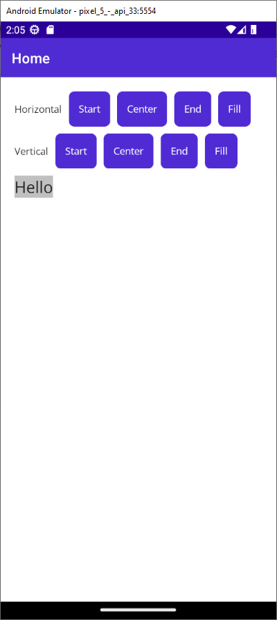
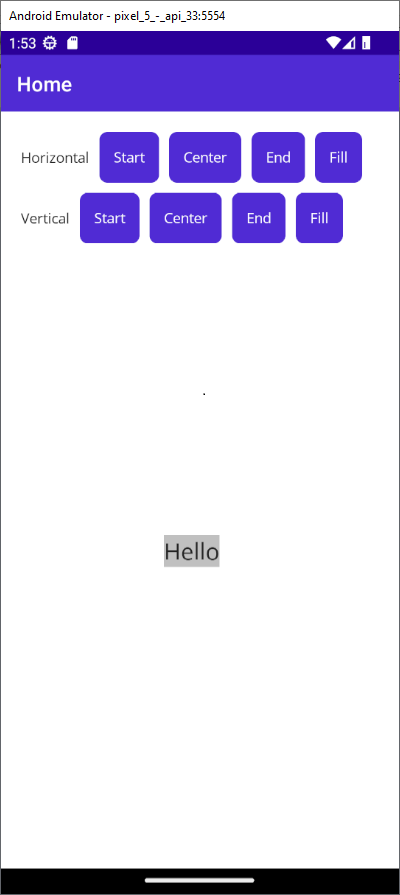
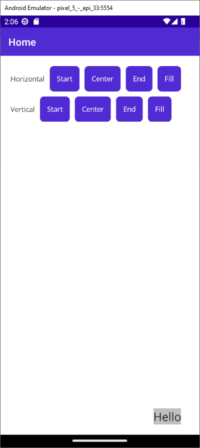
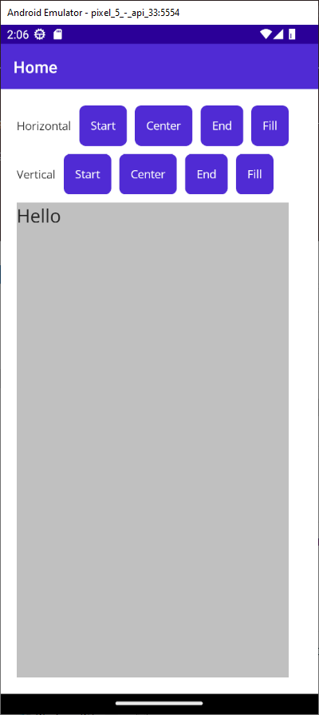

# Aligment Example

A small app to see the effect of the four primary layout options such a horizontal as vertical option. This four options are:

1. Start --> For horizontal aligment the control is align to the left hand side of the parent layout and for vertical aligment it possitions will be at top of the parent layout

2. Center --> For horizontal and vertical aligment, centers the control at parent layout

3. End --> For horizontal aligment, the control is align to the right hand side of the parent layout and for vertical aligment it possitions will be at bottom of the parent layout

4. Fill --> For horizontal aligment, the control fills the width of the parent layout and for vertical aligment it possitions fill the height of the parent layout
