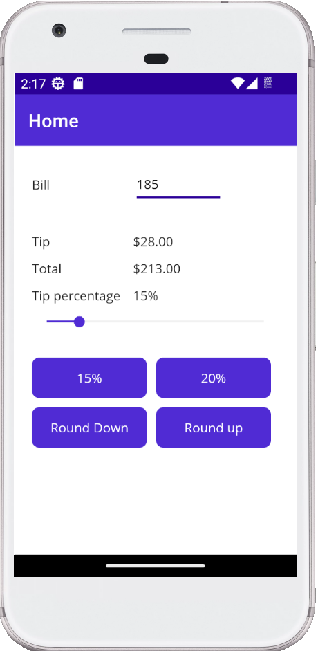

# Tip app StackLayout
This small app start with a basic layout with the controls placed in a stack.

The objective is transform the app layout usign a StackLayout containers as show the attach image

**Initial Layout**:

**End Layout**
