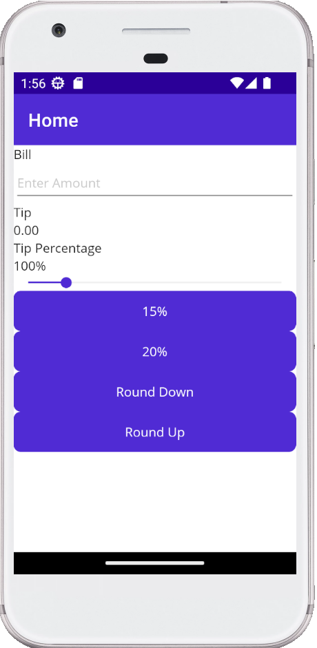
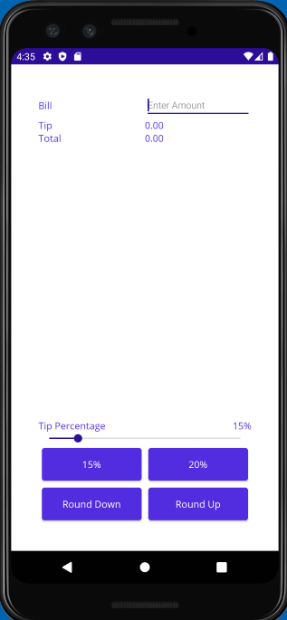

# Tip app Grid
This small app start with a basic layout with the controls placed in a stack.

The objective is transform the app layout usign a **grid** containers as show the attach images

**Initial Layout**:

**End Layout**
