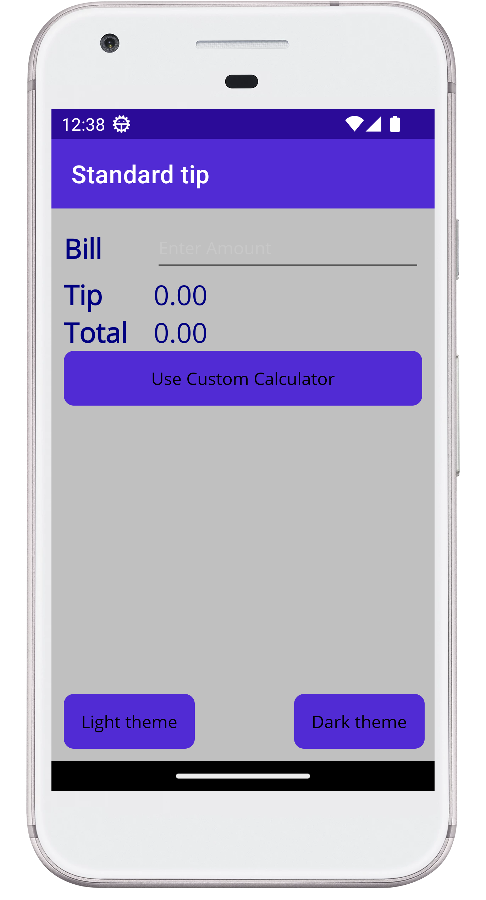

# Tip Calculator using page level resources

This execrcise will be targeted avoid some repetition in XAML, setitng up static resources at page level. The images show the application runing in a emulator device but the changes will be in the XAML files and do not show them in the images representation.
The app will be two pages that show below.

