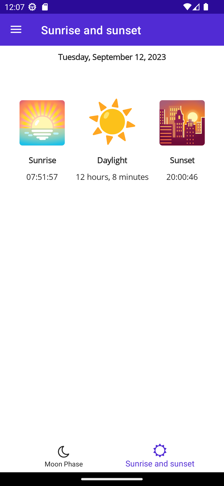
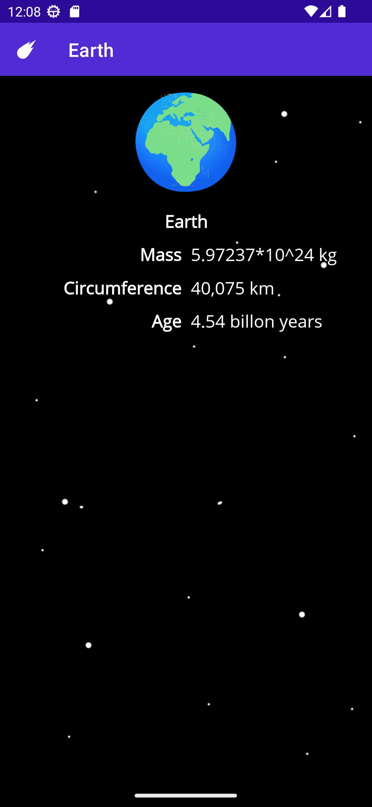
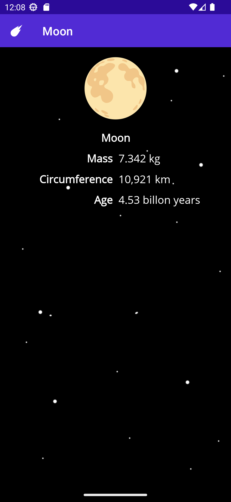
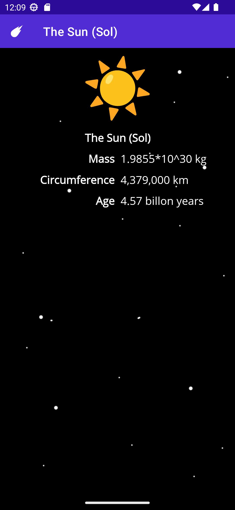
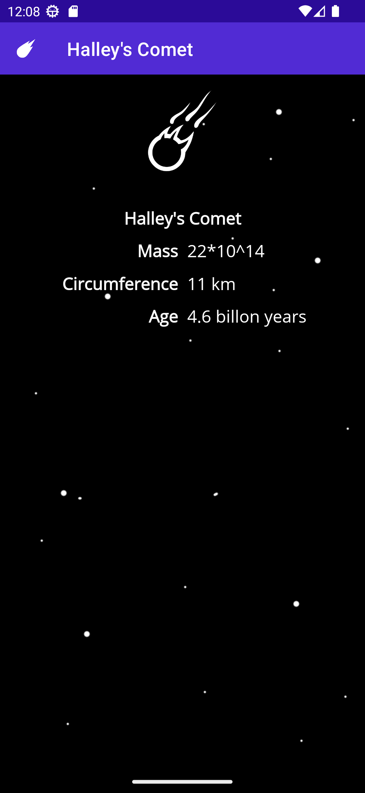

# Create multi-page apps with tab and flyout navigation

In this module will make a multi-page app that will use three navigation types:

1. Use a mixed flyout menu and tabbed to direct navigation between pages
1. Use a stack navigation navigate forward and backward

We add the all pages screenshots next:

Flyout moon phase option

Moon phases page

Sunrise and sunset page

Flyout astronomical data option

Astronomical data page

Earth data page

Moon data page

Sun data page

Halley's comet data page

